<!-- GitHub Profile README for Cola-1 -->

<h1 align="center">Hi, I'm Yangle Liu 👋</h1>

  BSc Computer Science · Machine Learning · Computer Vision · 3D Perception

  <a href="https://yangleliu.github.io/">Homepage</a> ·
  <a href="https://github.com/Cola-1">GitHub</a> ·
  <a href="https://scholar.google.com/">Google Scholar</a>

  
  
  

---

## About Me
I am a computer science undergraduate with a strong interest in **building intelligent systems that integrate perception, learning, and engineering**.

My work spans:
- **3D / 4D Computer Vision & Graphics**: 3DGS / 4DGS, dynamic scene reconstruction, geometry-aware learning  
- **Machine Learning Systems**: data-driven forecasting, structured representation learning, evaluation pipelines  
- **LLM-enhanced AI**: integrating large language models into perception and time-series tasks for improved reasoning and interpretability  

I care deeply about whether a system is **robust, efficient, and deployable**, not just whether it performs well in isolated experiments.

---

## News
- **Aug 2025**: Co-authored paper accepted for **Oral Presentation** at *IEEE BDAI 2025*  
- **Nov 2024**: First collaborative research paper accepted at *ICSTIS 2024*

---

## Selected Research & Projects

### Endo-G²T — Geometry-guided 4D Gaussian Splatting
- **Keywords**: 4DGS · temporally consistent reconstruction · geometry-aware training  
- **Summary**: A training framework for high-fidelity dynamic reconstruction in endoscopic scenes, emphasizing temporal coherence and geometric constraints  
- Links:
  - Paper: https://arxiv.org/
  - Code: https://github.com/Cola-1

---

### SEED — LLM-Enhanced Time Series Forecasting
- **Keywords**: multivariate forecasting · structural encoding · LLM-assisted decoding  
- **Summary**: A forecasting framework that combines structured temporal representations with the reasoning capability of large language models  
- Links:
  - Paper: https://arxiv.org/
  - Code: https://github.com/Cola-1

---

### Synthetic Dataset Generation for Underground Parking Scenes
- **Keywords**: simulation · Blender · synthetic data · autonomous perception  
- **Summary**: Automated generation of annotated underground parking datasets using Blender to reduce real-world data collection and labeling costs  
- Code: https://github.com/Cola-1

---

## Engineering-Oriented Projects

### AIHire — Intelligent Recruitment Platform
- Designed backend architecture using **Spring Boot** with clear relational modeling of jobs, applicants, and applications  
- Improved high-frequency data access using **Redis**  
- Enabled real-time interaction between HR and applicants via **WebSocket**  
- Led development of AI services using **LLMs** for resume enhancement, skill extraction, and vector-based matching  

This project shaped my system-level thinking by connecting backend design, real-time communication, and AI services into a single deployable pipeline.

---

## Experience
- **Machine Learning Intern**, Neurova (New York) · Jun 2025 – Aug 2025  
- **Software Development Intern**, AUO Digitech (Suzhou) · Jun 2024 – Aug 2024  

---

## Education
- **University of Liverpool (UK)**  
  BSc Computer Science · Sep 2024 – Present  

- **Xi’an Jiaotong–Liverpool University (Suzhou, China)**  
  Undergraduate Studies · Sep 2022 – Jun 2024  

---

## Honors & Awards
- RoboMaster Super Competition — Regional First Prize, National Second Prize  
- National College Student Information System Innovation Competition — Outstanding Award  
- Technology Innovation Association — 3D Modeling Project Lead  
- XJTLU Campus Ambassador — Pioneer Award  

---

## GitHub Analytics

  
  

  

---

## Metrics (Auto-updated via GitHub Actions)

  

---

## Tech Stack

  
  
  
  
  
  

  <i>Building intelligent systems that see, reason, and work in the real world.</i>

